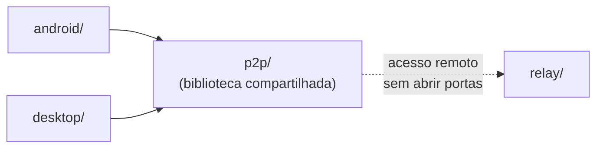

# Acerola

Ecossistema de leitura de quadrinhos/mangás locais com sincronização 100% P2P entre dispositivos — sem servidor central, sem conta, sem nuvem.

Este é um monorepo: cada plataforma vive isolada na sua própria pasta, com sua própria stack e seu próprio README completo. Nenhuma plataforma depende diretamente de outra — todas consomem a mesma biblioteca P2P compartilhada (`p2p/`).

| Pasta | Plataforma | Stack | Leia mais |
| --- | --- | --- | --- |
| [`android/`](android/README.md) | App Android nativo | Kotlin + Jetpack Compose | [android/README.md](android/README.md) |
| [`desktop/`](desktop/README.md) | App Desktop | Rust + Tauri + Svelte 5 | [desktop/README.md](desktop/README.md) |
| [`p2p/`](p2p/README.md) | Biblioteca P2P compartilhada | Rust (iroh / QUIC) | [p2p/README.md](p2p/README.md) |
| [`relay/`](relay/) | Relay de conexão P2P | Rust | — |

## Como as peças se conectam

`android/` e `desktop/` nunca se enxergam diretamente — cada um implementa sua própria FFI/binding para consumir `p2p/`. Toda comunicação entre dispositivos é P2P direta (LAN via mDNS) ou via `relay/` quando fora da mesma rede.

## Documentação

- Como contribuir: [CONTRIBUTING.md](CONTRIBUTING.md)
- Política de privacidade: [PRIVACY_POLICY.md](PRIVACY_POLICY.md)
- Licença: [LICENSE](LICENSE) (MPL-2.0, para todo o monorepo)
- TODO de cada plataforma: `android/TODO.md`, `desktop/TODO.md`, `p2p/TODO.md`
