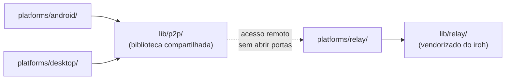

# Acerola

Ecossistema de leitura de quadrinhos/mangás locais com sincronização 100% P2P entre dispositivos — sem servidor central, sem conta, sem nuvem.

Este é um monorepo: cada plataforma vive isolada em `platforms/`, com sua própria stack e seu próprio README completo. Nenhuma plataforma depende diretamente de outra — todas consomem as bibliotecas compartilhadas em `lib/`.

| Pasta | Plataforma | Stack | Leia mais |
| --- | --- | --- | --- |
| [`platforms/android/`](platforms/android/README.md) | App Android nativo | Kotlin + Jetpack Compose | [platforms/android/README.md](platforms/android/README.md) |
| [`platforms/desktop/`](platforms/desktop/README.md) | App Desktop | Rust + Tauri + Svelte 5 | [platforms/desktop/README.md](platforms/desktop/README.md) |
| [`platforms/relay/`](platforms/relay/) | Serviço + UI de monitoramento do relay (deployável na VPS) | Rust — ainda não iniciado | — |
| [`lib/p2p/`](lib/p2p/README.md) | Biblioteca P2P compartilhada | Rust (iroh / QUIC) | [lib/p2p/README.md](lib/p2p/README.md) |
| [`lib/relay/`](lib/relay/) | Código do relay iroh vendorizado, base para `platforms/relay/` | Rust | — |

## Como as peças se conectam

`platforms/android/` e `platforms/desktop/` nunca se enxergam diretamente — cada um implementa sua própria FFI/binding para consumir `lib/p2p/`. Toda comunicação entre dispositivos é P2P direta (LAN via mDNS) ou via o relay (`platforms/relay/`, construído sobre `lib/relay/`) quando fora da mesma rede.

## Documentação

- Como contribuir: [CONTRIBUTING.md](CONTRIBUTING.md)
- Política de privacidade: [PRIVACY_POLICY.md](PRIVACY_POLICY.md)
- Licença: [LICENSE](LICENSE) (MPL-2.0, para todo o monorepo)
- TODO de cada plataforma: `platforms/android/TODO.md`, `platforms/desktop/TODO.md`, `lib/p2p/TODO.md`
- Assets usados nos READMEs (GitHub): [`docs/github/`](docs/github/)
- Futuro site de documentação: [`docs/web/`](docs/web/) (ainda vazio)
